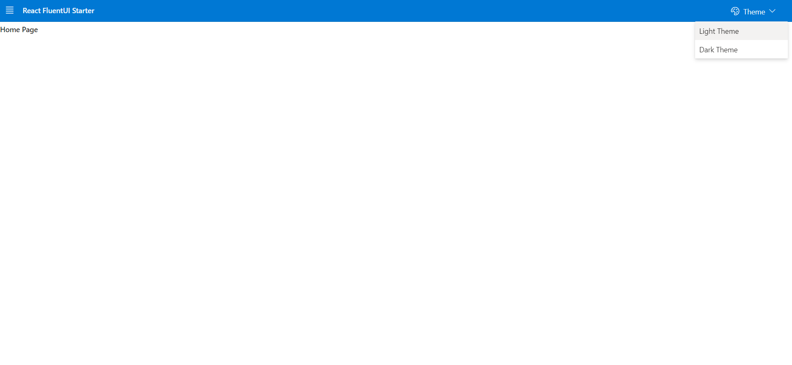
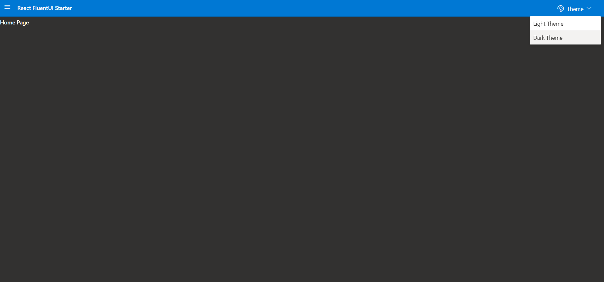
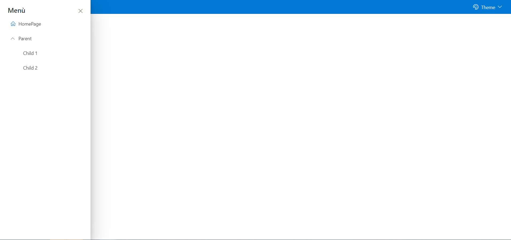

# React FluentUI Starter

This is a simple application created with [Create React App](https://github.com/facebook/create-react-app) based repo
that comes with Fluent UI pre-installed and configured!

# Getting started

1 - Install dependencies `npm install`

2 - Run the application `npm start`

# Screenshots

### Light Mode

### Dark Mode

### Sidenav

